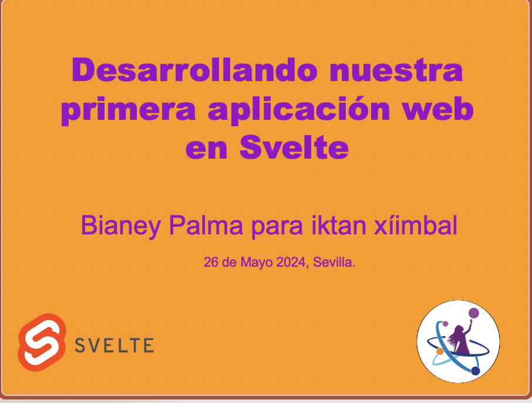

# Desarrollando nuestra primera aplicación web 

Nuestra ponente, la Dra. Bianey Palma Fernández mostrará cómo usar Svelte, un compilador Front End gratuito y de código abierto, como herramienta para el desarrollo de una sencilla app. Sobre todo, compartirá con ustedes dónde encontrar los recursos necesarios para llevar a cabo esta tarea con éxito.

* El código que se uso en el taller se encuentran en el folder *scripts*.

* Liga para seguir el taller sin instalar software y registrarse a la plataforma de desarrollo gratuita: https://codedamn.com/ 

* Luego puedes ingresar [ a nuestro Play Ground](https://codedamn.com/playground/VRVocoxXZgAbvKBx6NdOp
) para que puedas replicar el contenido del taller.

* Recursos:
Después de este curso pueden explorar con otros como:

  * [Svelte](https://svelte.dev/repl/hello-world)
  * [Svelte playground](https://playcode.io/svelte)
  * [Codesandbox](https://codesandbox.io/p/sandbox/svelte-playground-u07x0?file=%2Findex.js)

